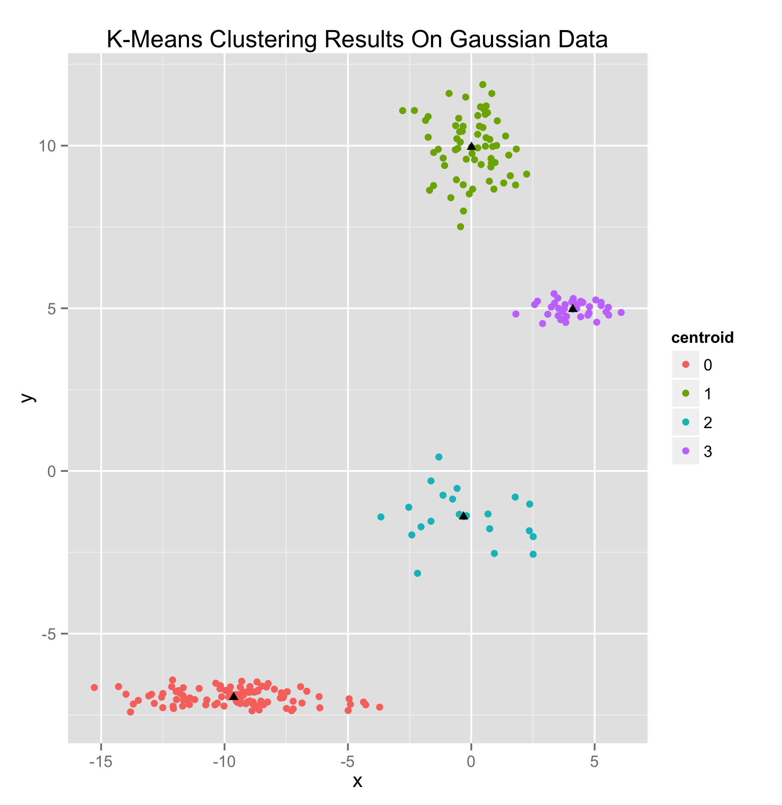

## Clustering Algorithms (Supervised and Unsupervised)
### `import "github.com/cdipaolo/goml/cluster"`

[](https://godoc.org/github.com/cdipaolo/goml/cluster)

This part of the `goml` package implements clustering algorithms, unsupervised _and_ supervised, to give the user options about what model they want to use.

### implemented models

- [k-means clustering](kmeans.go)

### example k-means model usage

This code produces two clusters (as expected,) which result in the following plot (made with `gnuplot`.) Note that I abbreviated the resultant dataset so you can actually see individual points:



```go
// initialize data with 2 clusters
double := [][]float64{}
for i := -10.0; i < -3; i += 0.1 {
	for j := -10.0; j < 10; j += 0.1 {
		double = append(double, []float64{i, j})
	}
}

for i := 3.0; i < 10; i += 0.1 {
	for j := -10.0; j < 10; j += 0.1 {
		double = append(double, []float64{i, j})
	}
}

model := NewKMeans(2, 30, double)

if model.Learn() != nil {
	panic("Oh NO!!! There was an error learning!!")
}

// now predict with the same training set and
// make sure the classes are the same within
// each block
c1, err := model.Predict([]float64{-7.5, 0})
if err != nil {
	panic("prediction error")
}

c2, err := model.Predict([]float64{7.5, 0})
if err != nil {
	panic("prediction error")
}

// now you can predict like normal!
guess, err := model.Predict([]float64{-3, 6})
if err != nil {
	panic("prediction error")
}

// or if you want to get the clustering
// results from the data
results := model.Guesses()

// you can also concat that with the
// training set and save it to a file
// (if you wanted to plot it or something)
err = model.SaveClusteredData("/tmp/.goml/KMeansResults.csv")
if err != nil {
	panic("file save error")
}

// you can also persist the model to a
// file
err = model.PersistToFile("/tmp/.goml/KMeans.csv")
if err != nil {
	panic("file save error")
}

// and also restore from file (at a
// later time if you want)
err = model.RestoreFromFile("/tmp/.goml/KMeans.csv")
if err != nil {
	panic("file save error")
}
```
